# Who Wants to be a Millionaire ?
🚨**Required** 
"Who Want to be a Millionaire?" is a British television show first created by David Briggs, Steven Knight and Mike Whitehill for the ITV network in 1998. This application is just a clone of that concept. In simple words, a game in which the participant should answer 15 questions to get to the one million prize. 

The game is divided into 3 sections of questions 5 questions for each level(Easy, Medium and Hard). The game will be terminated whenever a player chooses a wrong option for the shown question. 

When the game starts there are 4 option to choose from. 1. Player can start the game. 2 Player can show the rules under How to play section. 3 Showing the scoring board sorted from the highest to the lowest. 4 Quitting the game. 

If a player chooses to start the game, s/he needs to type his full name and his country. Theses information will be saved in the scoring board.

## Flowchart of the Game:

In Software industry, it is extremely important to have a complete understanding of when the process starts and when it ends as well as what happens in between. Following flowchart shows how the play begins and when it ends.

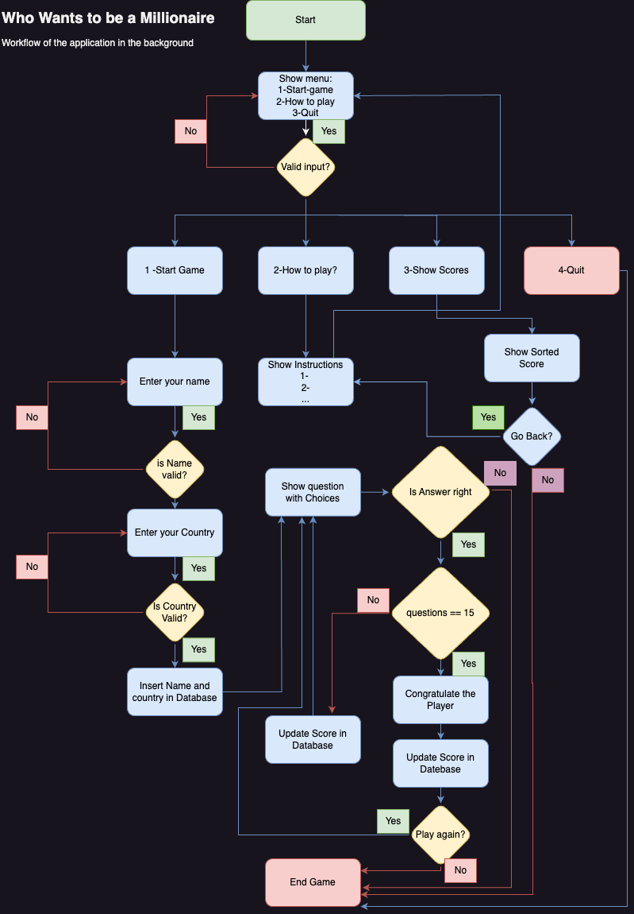

Following is a video about the end product:


https://github.com/AlAliMazen/who-wants-to-be-a-millionair/assets/153659892/3c86518a-9145-4fe7-a29b-fea526366e72


## Live Site
🚨**Required** 

- [Who Wants to Be a Millionaire?](https://whowantstobeamillionaire24-bb20122b77fb.herokuapp.com/)

## Repository
🚨**Required** 

- A complete repository for the game is under [Who Wants to Be a Millionaire?](https://github.com/AlAliMazen/who-wants-to-be-a-millionair)

## Author
🚨**Required** 

Mazen Al Ali

## Table of Contents
🚀 **merit & beyond**

### Screenshots and Videos


# Table of Contents
🚀 **merit & beyond**

- [PROJECT NAME](#project-name)
  - [Live Site](#live-site)
  - [Repository](#repository)
  - [Author](#author)
  - [Table of Contents](#table-of-contents)
  - [How To Play/Use](#how-to-playuse)
  - [Features](#features)
    - [Implemented Features](#implemented-features)
    - [Future Features](#future-features)
  - [Flow Chart](#flow-chart)
  - [Data Model/ Classes](#data-model-classes)
    - [Class X](#class-x)
  - [Libraries used](#libraries-used)
  - [Testing](#testing)
    - [Validation Testing](#validation-testing)
    - [Manual Testing](#manual-testing)
    - [Defect Tracking](#defect-tracking)
    - [Defects of Note](#defects-of-note)
    - [Outstanding Defects](#outstanding-defects)
    - [Commenting Code](#commenting-code)
  - [Deployment](#deployment)
    - [Requirements](#requirements)
    - [Gitpod](#gitpod)
    - [Heroku](#heroku)
  - [Credits](#credits)
    - [Content](#content)
    - [Media](#media)
    - [Acknowledgments](#acknowledgments)
    


====================================== The Sections you Fill in are below ==============================


## How To Play/Use
🚨**Required** 

When the Game starts it does execute the following steps before the player is able to type an choice. First of all it reads the questions text files and split them into lists preparing them for inserting in the Google drive sheets. Only if the google sheets allocated for the questions are empty, the population process will be executed. Each question sheet has 20 question. There are 3 types of questions (Easy, Medium and Hard)

How to play when game starts?

    1- Choose one of the options 1,2,3 or 4 
    2- To start the game choose 1 . This option will be forwarded to ask the player to type his name and his country and press enter key after each input.
    3- Console will be cleared and a line at the top of the console will be shown with player name, country, score and question level
    4- A question will be shown with 4 options 1 to 4 . Player can type his option by pressing keys of 1 to 4 .
    5- In case the option is the same as the right answer, the score will be incremented, console will be cleared and a new question will be shown.
    6- In case the option isn't right, the game will be terminated indicating the player loses the round and his current score. 
    7- If player chooses the second option, the rules and How-to instructions are going to be shown. Player can also either end the game by pressing e or going back to the menu by pressing y
    8- When the third option is clicked the scoring board will be loaded from the google sheet and it is sorted based on the score 
    9- If player chooses to quit the game, s/he should only choose number 4 and game will be terminated.

## Features
🚨**Required** 


### Implemented Features
🚨**Required** 

From a developer point of view this version of the game implements the concept of the OOP and makes use of the class concept. Player as well as Question both have their separated files and initialized in another procedural python file.

Another Feature is the validation process of user input, either whe Player still at the main menu of the game or when the question is displayed. The validation process makes use of the Regular Expressions.

Safety Score Calculation: when player loses the round a call to the player object and let it check the last score the player has got. If it is more than 1000 then 1000 will be his last score instead of 0. In the same manner when player loses the round and his is at questions more than 10, player will get back to 32000 instead of 0 or 1000 .

Last but not least, the game makes use of the live score tracking. In other words, whenever the player gets the right answer for the shown question, h/his score is going to be incremented (make use of the player object implemented methods) and shown right at the top of the game. 


### Future Features
🚀 **merit & beyond**

The possibility for the player to remove two wrong options will be a good future feature to implement later on. This feature will be available be the medium and hard questions and only to be used once in the whole round.


## Flow Chart
🚀 **merit & beyond**

The following flow chart shows how the game starts and what happen by choosing options 


## Data Model/ Classes
🚨**Required** 

### Player

As the name implies the ***Player*** class is created to collect the player information like full name and country and it gives a default score of zero to the player object. The class has then the following properties:


**Properties**
- full name 1: is a {string} type like in John Smith. It can't have any special character.
- country 2: is a {string} it represents the country of the player and it also can't have any special character.
- score 3: is an integer type initialized with 0 as default type when an object of the Player class.

**Methods**
- **\_\_init\_\_**: Initialize method, it starts the class off a list which holds the values of full name and country.
- **get_player_details(self)**: It returns the details of the current player as a list (full name and country).
- **get_player_with_score(self)**: It returns the current player details with h/her score as a list.
- **increase_player_score(self, index)**: Based on the index of the question, the score is going to be increased be itself. In order to get the million after answering 15 questions, then two questions should be assigned by magic win values (Question 5 and question 12 for example).
- **update_safety_score(self)**: this method works as a safety limit when the player loses the round. If Player loses when s/he got more than 1000 $, it will return to 10000 . Likewise, when Player gets more than 32000 s/he get back to the 32000 . It returns the last valid score.

- **play_again(self)**: called only to reset the current player score back to zero. It is called when player loses the round or wins the game.

### Question

The second class used inside this version of the game is the question it self. This Class is used for each question shown. When the game starts, the play gets a complete list of 15 randomly selected questions and every question is an object of this class.

Questions are of three levels easy, medium and hard. Questions are going to be read from text files and uploaded to the google sheets. the question inside the file has a question and four options and the index of the right answer at the end.

**Properties**

- question: the question itself like in what's the smallest prime number.
- option a til d : the options of the shown question from a to b and will be shown as 1 to 4 .
- r_index: the right answer index : this index is used to check against the player's choice. 

It is worth mentioning that all the previous properties are used in the constructor to initialize the object. These properties are given as a list from the ***utilities*** Module.

**Methods**

- **check_usr_answer(self, usr_answer)**: It return True when the usr_answer parameter is the same as the r_index of the question object.
- **get_question_txt(self)**: When the question class is called, an object of this class is initialized and it makes it easier to control it. This method returns the question text itself. 
- **get_question_option(self, option)**: since the question is an object, this function will give a static index to this function and it returns the option of that question at this index. 

## Data Module

### utilities
This is the main python where the heavy load is executed. This file contains only functions and it is procedural; that is, it contains no class only objects of the previous two classes. Functions are as the following:

- **split_list(list, single_question)**: used to split the questions' list into separated single lists of questions. Thus, if the list contains 20 questions in one single list, it be returned as a list of 20 lists and each list represents one single question. 

- **read_file(file)**: used for reading the questions from text files line by line and collects the content in a list. It calls the split_list function to split the big list into single question.
- **print_game_title()**: used to print the Game title every time the game starts and a new question is printed.
- **print_game_menu()**: Called whenever the game starts or after the rules are shown. It shows the 4 options available for the player. It is worth mentioning that the two previous functions print the title, options and the question later on as formatted style; that is in the middle of the console with padding before and after the text. 
- **show_game_instructions()**: When player selects number 2, the rules and how-to play instructions are shown. 
- **get_user_choice()**: called after the instructions are shown and waits till player chooses either y for yes to go back to the main options or e for quitting the game.
- **clear_console()**: This function clears the console after player types h/his option. It makes use of the os and platform module to detect the operation system and give the corresponding command to the terminal either cls for Windows prompt and clear for macOS and Linux terminals. 

- **get_player_data()**: used when the player is asked to type his full name and country and makes use of input() function. It calls the validation function to check the player input.
- **validate_string_input(str_input, type)**: used to check if the player's full name has noc special character. It makes use of the regular expressions which accepts only small and capital letters with spaces.
- **validate_integer_input(usr_choice)**: used to check if the numeric user input whether it is from the main menu or the questions options. It checks that the input contains only options from 1 to 4 .

- **update_questions_worksheet(question_level,questions_list)**: after splitting the question list into mini lists of single questions, this function takes that lists and insert them into the google sheet. 

- **read_questions_txt_files()**: this function makes use of the os library and the function get current working directory getcwd() which ready the directory of the question files and then reads the question into variables. Then it calls the update_questions_worksheet().

- **get_random_question_index(question_list)**: this function is used to get five random questions from the given question list.

- **get_question_ready()**: it prepares a list of ordered 15 questions in a list. The first 5 questions are easy, then medium and the last 5 are hard questions. This functions makes a call to the google sheet to load all the questions in all levels in separated lists.

- **get_question(index)**: this is where a question object is created and the index is going to be from the UI interface in a loop fo 15 indexes. The list which is created in the previous function is used to be iterated and the index is the list which is used to initialized the question object.

- **print_question_with_choices(question, index)**: prints the question object with its choices as formatted text with padding and the question is printed underlined. 

- **print_player_info(player, q_index)**: When the game starts the player object is used in this function to print a line at the top of the console to show the current player name, country, score and level. the second parameter q_index is used to detect the question level. 

- **update_scoring_sheet(player, index)**: 
used to update the google sheet when the player wins or loses the round. It makes a call to update the scoring sheet with player info and h/his score with the date.

- **print_winner_info(player, index)**:gets called when the player only wins the game to print a text indicating that the game is over and player has won the prize.

- **get_scoring_board()**: When a player chooses number 3 right from the beginning to see the scoring board, this function is called to print sorted results of the player who participate in the game with their details (full name, country, score, level of question reached and date).

- **play_again_mechanism(player_obj)**: When player loses the round or wins the game, then player is going to be asked to play again. If the choice is yes, then the score of the same player should be reset to zero. 

- **end_game_message()**: when player ends the game or wants to quit the game, then this function is called to print a nice message. 


### game

this module contains the main function which is used to wait for user input. When game starts it shows four choices and each choice will call a function from the ***utilities*** python file. 

- **get_player_info()**: used to get the details of the player when s/he starts the game. Then, it updates the google sheet.

- **start_game(player_obj)**: As the name implies, this function is called when the game itself starts. It gets the questions list ready and starts through a loop of 15 iterations.

- **main()**: the main function when the game runs. This function is going to be called from the run.py.


## Libraries used
🚀 **merit & beyond**

| Library                    | Usage                                                                                                                                                                                                                                                                                           |
|----------------------------|-------------------------------------------------------------------------------------------------------------------------------------------------------------------------------------------------------------------------------------------------------------------------------------------------|
| cachetools 5.3.3           | This module provides various memoizing collections and decorators, including variants of the Python Standard Library                                                                                                                                                                            |
| certifi 2024.2.2           | Certifi provides Mozilla’s carefully curated collection of Root Certificates for validating the trustworthiness of SSL certificates while verifying the identity of TLS hosts. It has been extracted from the Requests project.                                                                 |
| charset-normalizer 3.3.2   | A library that helps you read text from an unknown charset encoding.                                                                                                                                                                                                                            |
| google-auth 2.29.0         | This library simplifies using Google’s various server-to-server authentication mechanisms to access Google APIs.                                                                                                                                                                                |
| google-auth-oauthlib 1.2.0 | This library provides oauthlib integration with google-auth.                                                                                                                                                                                                                                    |
| gspread 6.0.2              | Simple interface for working with Google Sheets.                                                                                                                                                                                                                                                |
|                            | Features:                                                                                                                                                                                                                                                                                       |
|                            |  - Open a spreadsheet by title, key or URL.                                                                                                                                                                                                                                                     |
|                            |  - Read, write, and format cell ranges.                                                                                                                                                                                                                                                         |
|                            |  - Sharing and access control.                                                                                                                                                                                                                                                                  |
|                            |  - Batching updates                                                                                                                                                                                                                                                                             |
| idna 3.6                   | Support for the Internationalized Domain Names in Applications (IDNA) protocol as specified in RFC 5891. This is the latest version of the protocol and is sometimes referred to as “IDNA 2008”.                                                                                                |
|                            | This library also provides support for Unicode Technical Standard 46, Unicode IDNA Compatibility Processing.                                                                                                                                                                                    |
| oauthlib 3.2.2             | OAuthLib is a framework which implements the logic of OAuth1 or OAuth2 without assuming a specific HTTP request object or web framework. Use it to graft OAuth client support onto your favorite HTTP library, or provide support onto your favourite web framework.                            |
| pyasn 1.6.2                | pyasn is a Python extension module that enables very fast IP address to Autonomous System Number lookups. Current state and Historical lookups can be done, based on the MRT/RIB BGP archive used as input.                                                                                     |
| pyasn1-modules 0.3.0       | The pyasn1-modules package contains a collection of ASN.1 data structures expressed as Python classes based on pyasn1 data model.                                                                                                                                                               |
| requests 2.31.0            | Requests allows you to send HTTP/1.1 requests extremely easily. There’s no need to manually add query strings  to your URLs, or to form-encode your PUT & POST data — but nowadays, just use the json method!                                                                                   |
| requests-oauthlib 2.0.0    | OAuth 1 can seem overly complicated and it sure has its quirks. Luckily, requests_oauthlib hides most of these and let you focus at the task at hand.                                                                                                                                           |
| rsa 4.9                    | Python-RSA is a pure-Python RSA implementation. It supports encryption and decryption, signing and verifying signatures, and key generation according to PKCS#1 version 1.5. It can be used as a Python library as well as on the commandline. The code was mostly written by Sybren A. Stüvel. |
| StrEnum 0.4.15             | StrEnum is a Python enum.Enum that inherits from str to complement enum.IntEnum in the standard library. Supports python 3.7+.                                                                                                                                                                  |
| urllib3 2.2.1              | urllib3 is a powerful, user-friendly HTTP client for Python. Much of the Python ecosystem already uses urllib3 and you should too.                                                                                                                                                              |

## Testing
🚨**Required** 

This section will shed light on validation of my code according the standards of python and some strategies which help to maintain readability.


### Validation Testing
🚨**Required** 

You should try to ensure you code is valid and follows proper indentation.  In this section you should write up any websites you used to validate your code. As your projects becomes more complex these tools may change.

For each python file in your project, paste it into [CI's pep8 tool](https://pep8ci.herokuapp.com/), and take a screenshot of the linter output showing NO ERRORS


Ideally you would have no errors remaining outside of line too long which you can fix by 

adding
```$python 
# noqa
```
There is a space before the # and after it to skip the quality assurance for that line.

Note any errors or warnings you are ignoring and why.

### Manual Testing
🚨**Required** 

Use Markdown to track how you tested each bit of user input for each valid option, various invalid entries and leading/trailing spaces

**Feature 1**
- [ ] invalid entry, says sorry and re-prompts
- [ ] no entry, says sorry and re-prompts
- [ ] alpha when numeric expected, sorry and re-prompts
- [ ] valid entry with leading spaces, trimmed and shows proper next stage
- [ ] valid entry with trailing spaces, trimmed and shows proper next stage

You should also call out how you tested any other features such as:
- Welcome Message, recaps username
- Score update shows current score
- color change for correct vs incorrect
- google sheet updated properly

If you prefer spreadsheets, create a google-sheet and link to it in this section, just make sure you update the permissions to allow anyone to view it. You can make a [COPY of this example](https://docs.google.com/spreadsheets/d/1w_JUmFfzHVtXdHse6ib82BGnRMPlPqufSOnAVN3bVl8/edit?usp=sharing) and update it as your own. Just make sure you share it to anyone with the link:
https://docs.google.com/spreadsheets/d/1w_JUmFfzHVtXdHse6ib82BGnRMPlPqufSOnAVN3bVl8/edit?usp=sharing

### Defect Tracking
🚨**Required** 

Try to create issues in real time as it better reflects the daily life of a developer.

The easiest way to track defects is by using GITHUB's Issues to track these as it's really easy to copy/paste screenshots in and then write up how you closed them. At this stage you don't need a custom template or labels, that comes in P4.

 Here's a [guide to GitHub Defects](Defects.md)

### Defects of Note
🚀 **merit & beyond**

Some defects are more pesky than others. Highlight 3-5 of the bugs that drove you the most nuts and link to them directly here.


### Outstanding Defects
🚨**Required** 

I don't know if the following issus is considered as a failure. It is only present on the deployed version. Since the console is not completely cleared, then player can scroll up and see the past questions and options.


### Commenting Code
🚀 **merit & beyond**

Every function in the code whether it is inside a class or a module is commented as descriptive as possible. The main purpose of the comment is to indicate the purpose why the function is written and what it does. 

It is worth mentioning that all the functions are also explained here in the README file.

## Deployment
🚨**Required** 

### Prerequisites
🚨**Required** 


1. **Google Account:** In order to have this program work, you need a google account. If you don't have one  [Create a google account](https://accounts.google.com/Signup)

2. **Google Sheets**: After setting up an account (free) I had to set a google sheet like an excel for the following player, easy_quesitons, medium_questions, hard_questions, scoring. These working sheets are inside one sheet called "who_wants_to_be_a_millionair"

following screenshots are the structure of the pre-mentioned working sheets:

Player:

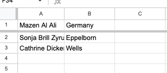

Easy Questions:

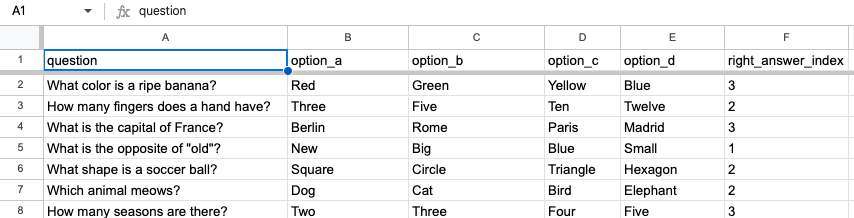

Medium Questions:

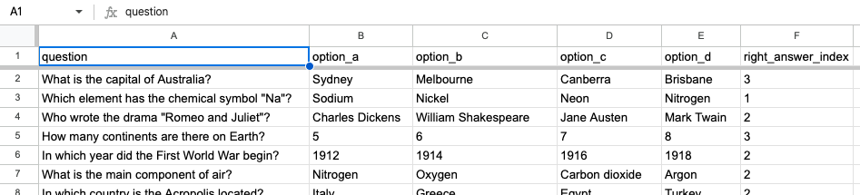

Hard Questions:

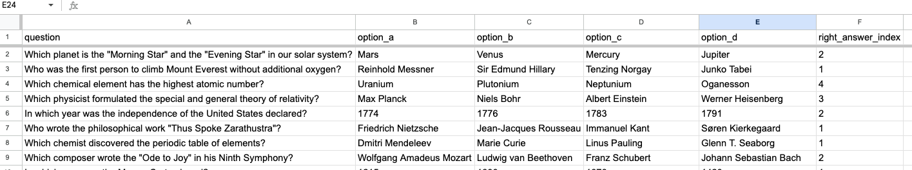

Scoring

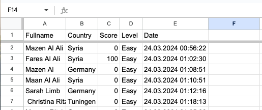


2. **Google APIs**
  Since this is a backend project, it needs an API where it makes calls to and from it. To set up the Google API, it is important to be on a **non-organizational account** but rather a free account. I followed the steps shown through out the course. Here are the steps to get the credentials needed to connect to this API:

   
    1. Log in to [Google console cloud](https://console.cloud.google.com/getting-started?pli=1)
        
        **GOOGLE DRIVE API Access**
        1. Create a new project in and make sure that the name has no spaces or special character 

        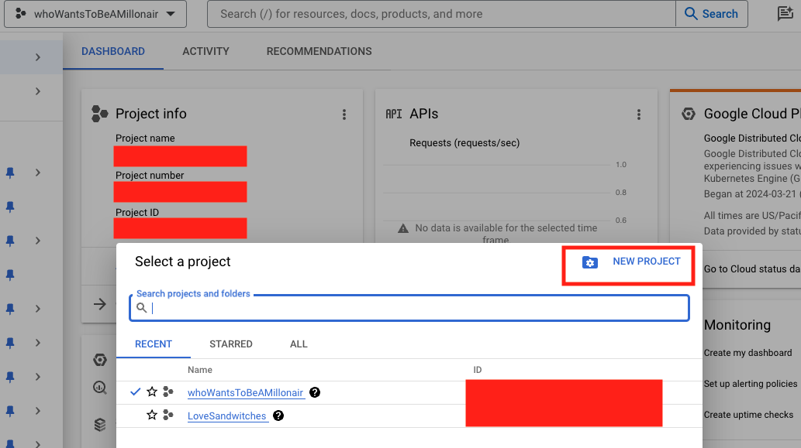


        2. Then click on Add APIs and Services and select Libraries
        3. Search for Google Drive
        4. Click Enable
        5. Select Google Drive API from the drop down, Application Data, then no and click the Next Button

        6. for service account details fill in a service account name ex) xxx_API, then click Create and Continue
        7. For the Accoun acces, select Role: Basic/Editor then continue
        8. Then Click Done
        9. Now select the newly created service account
        10. Click on the KEYS Tab
          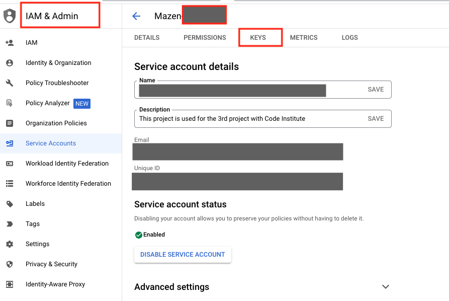


        11. Click Add Key
        
        12. After choosing JSON as keys type, it will be possible to download this file. Click on the link to download the JSON keys.
        
        **GOOGLE SHEETS API Access**
        You may need to us the back button get to the APIS & SErvices section from where you were.
        1. click the Library  Tab and search for Google Sheets
        2. click enable (no need to go )

3. The downloaded JSON file should then be added to the same directory where the project is cloned. As for me I use VS Code as IDE. I renamed this file as creds and it looks like the following:
  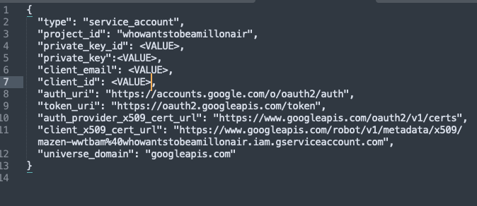

4. Share the "client_mail" with the pre-created Google-sheet as in the following screenshot
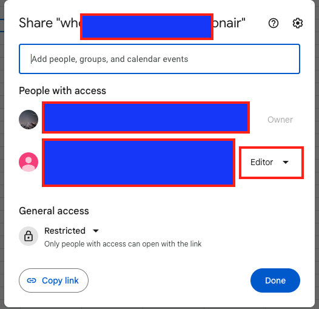


**ATTENTION**

It is important to run the following command in order to install the dependencies required to connect and integration of Google API and Google Sheets. Thus, after adding the JSON file to the project directory, run the following commands

  ```
  pip3 install gspread google-auth
  ````


### Heroku
🚨**Required** 

This section should describe the process for deploying the project on a live server for backend applications. Heroku is free for only 5 applications and it needs a credit card for setting up an account. I also followed the steps shown through the course. 

***IMPORTANT**

before heading to heroku, make sure to to run the following command in your IDE to freeze the packages in the requirements.tyt file. In other words, in your IDE and after making sure that everything is good run the following command in the terminal to list all the packages required for the deployment on Heroku.

````
pip3 freeze > requirements.txt
````


1.  New Project
After successfully setting up an account go to the dashboard by clicking on the account icon on the top right corner and choose to create a new App from the "New" button shown.
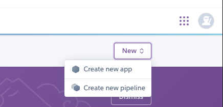


2.  Give the app a unique name with no special character or spaces.

3. Head to **Settings** tab in order to set the "Config Vars" and "Build Packages"

  A. **Config Vars**

    Because the credentials are  specific to each user, the JSON file which was downloaded from Google API should be also hidden when deployed. Add a new configuration variable  and past the value of JSON file as a value of the KEY which should also have a name with all capital letters 

  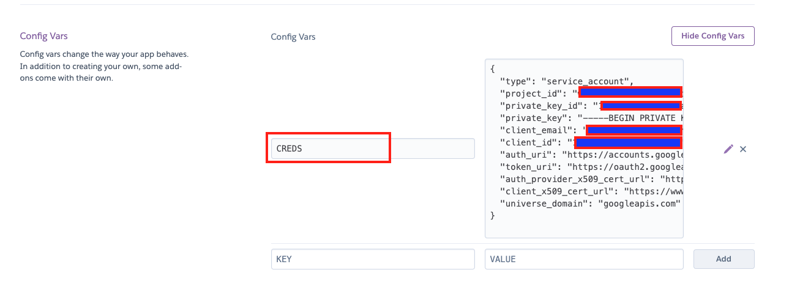

    


  B. **Build Packs**

  Under the build Packages, choose to add the python and then Node.js

  

    


4. Deploy
  
  A. Under **Deploy** tab choose gitHub as main source of the code source

  B. Login to GitHub and choose the repository for the project you want to deploy.

  C. Scroll down to the **deploys** where there two kinds of deployment. If you want to let the Heroku to get the latest pushes ***Automatically** then choose **Automatic deploys** and click on save. Otherwise, choose **Manuel deploy** if you want the Heroku to deploy specific forks from the main GitHib Repo.

  As for me, I chose the first option to let the Heroku deploy the latest updates to the master branch.

  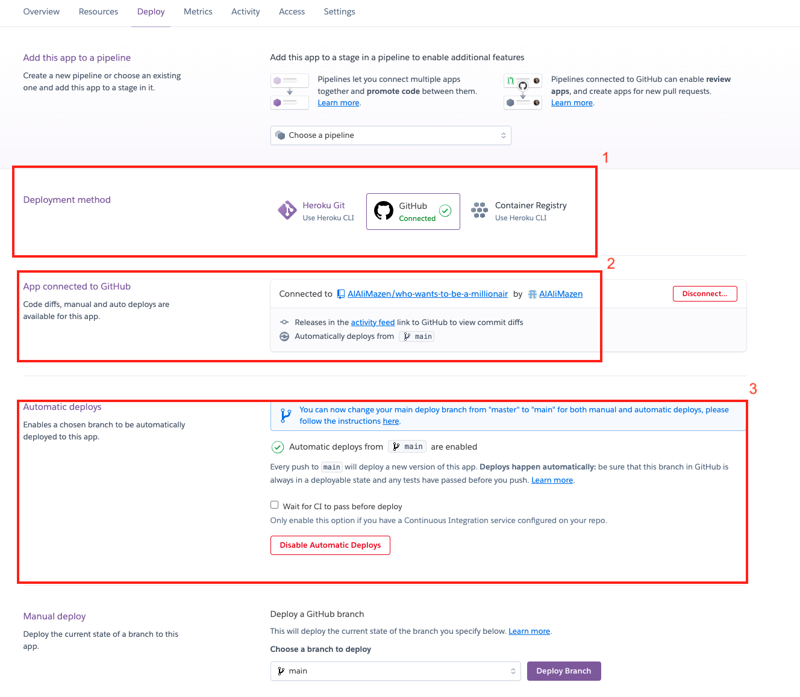

  Clicking Yes and save will let the heroku look at the requirements file to start installing the required packages and deploy the app. When it is ready, it will show a link to open the App in both Heroku App page and on GitHub Project Repository.


## Credits
🚨**Required** 


- [Code Institute Template](https://github.com/Code-Institute-Org/python-essentials-template) Used to set up the GitHub Repository and open it in the CodeAnyWhere IDE.

### Content
🚨**Required** 

I have used the following websites to get some code references and example:

- Sorting python list [sorting python list - free code camp](https://www.freecodecamp.org/news/python-list-sorting-how-to-order-lists-in-python/)

- Adding padding to the text [Codeguage](https://www.codeguage.com/courses/python/strings-string-padding#:~:text=String%20padding%20is%20to%20extend,a%20table%20in%20the%20shell.)

- Coloring the Console line [how do I colored text in python](https://ask.replit.com/t/how-do-i-make-colored-text-in-python/29288)

- Classes in python is from [Python.org Docs](https://docs.python.org/3/tutorial/classes.html)

- Regular Expressions in python [Python RegEx](https://www.w3schools.com/python/python_regex.asp)

- Regular Expression from python official Docs [re — Regular expression operations](https://docs.python.org/3/library/re.html)

- References for the gspread is from the official gspread documentation [gspread](https://docs.gspread.org/en/latest/)


- Detecting the operating system and controlling the console is from [Geeks for Geeks](https://www.geeksforgeeks.org/python-os-uname-method/)


### Acknowledgments
🚨**Required** 

- My Mentor Mrs. Malia Havlicek who helped me to code the best logic possible and guide me to detect my bugs. 

- Code Institute [Full-Stack Development Course](https://codeinstitute.net/de/full-stack-software-development-diploma/)


